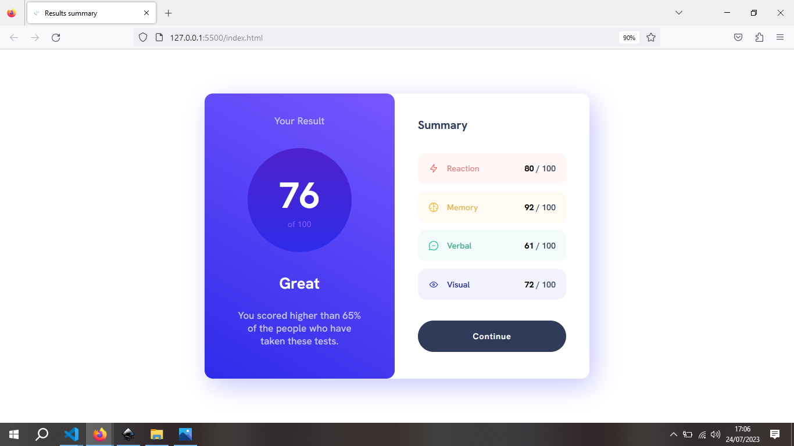
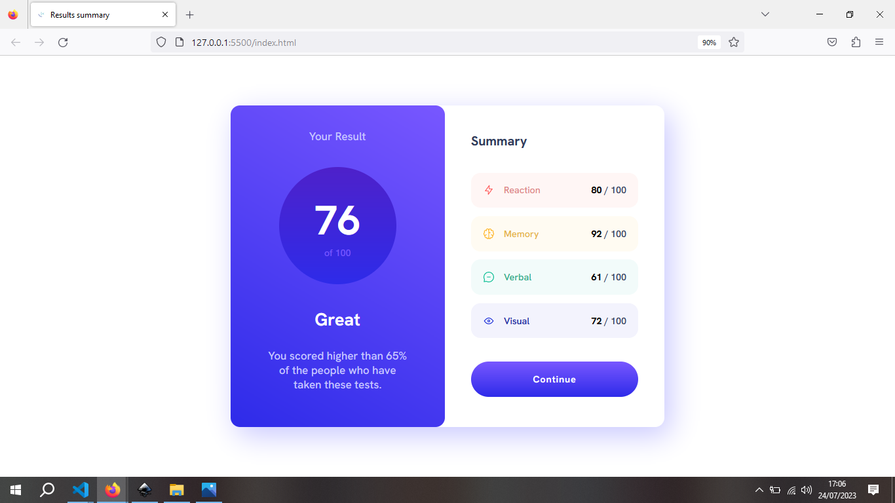
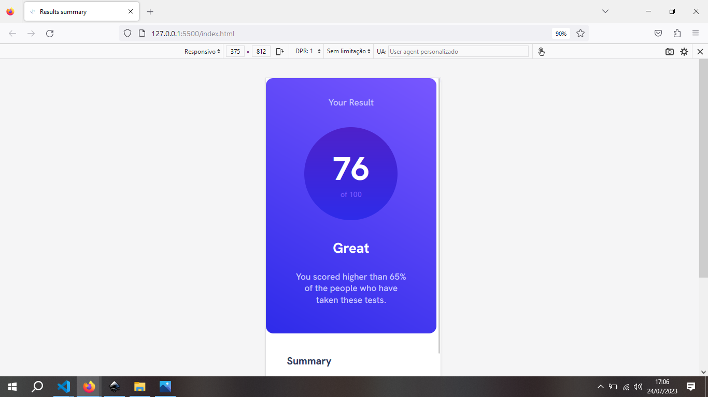
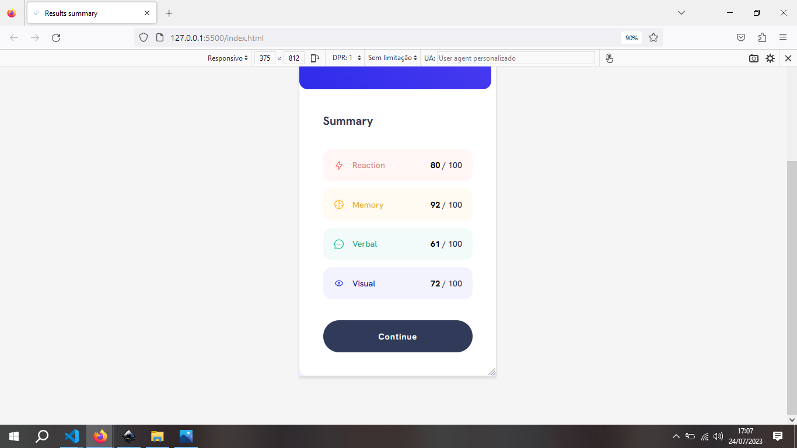

<h1>Result Summary Front-end Mentor</h1>
 

Neste desafio, utilizei apenas HTML e CSS. Eu não riria fazer esses desafios de HTML e CSS pois achei muito fácil quando vi, porém está sendo interessante realizar pois estou vendo dificuldades em certos aspectos como, estrutura HTML, SEO e Semântica.

 

 
<h2>Layout Desktop</h2>
 

 

 
<h2>Layout Desktop com Hover</h2>
 

 

 
<h2>Layout Mobile</h2>
 

 

 
<h2>Layout Mobile</h2>
 

 
<h3>Sobre o desafio</h3>
 

Durante esse desafio, eu tive que parar uns dias pois eu realizei um freela para um cliente onde trabalhei com WEBFLOW, o que me deixou mais animado para continar estudando. Gostei do resultado.</h3>